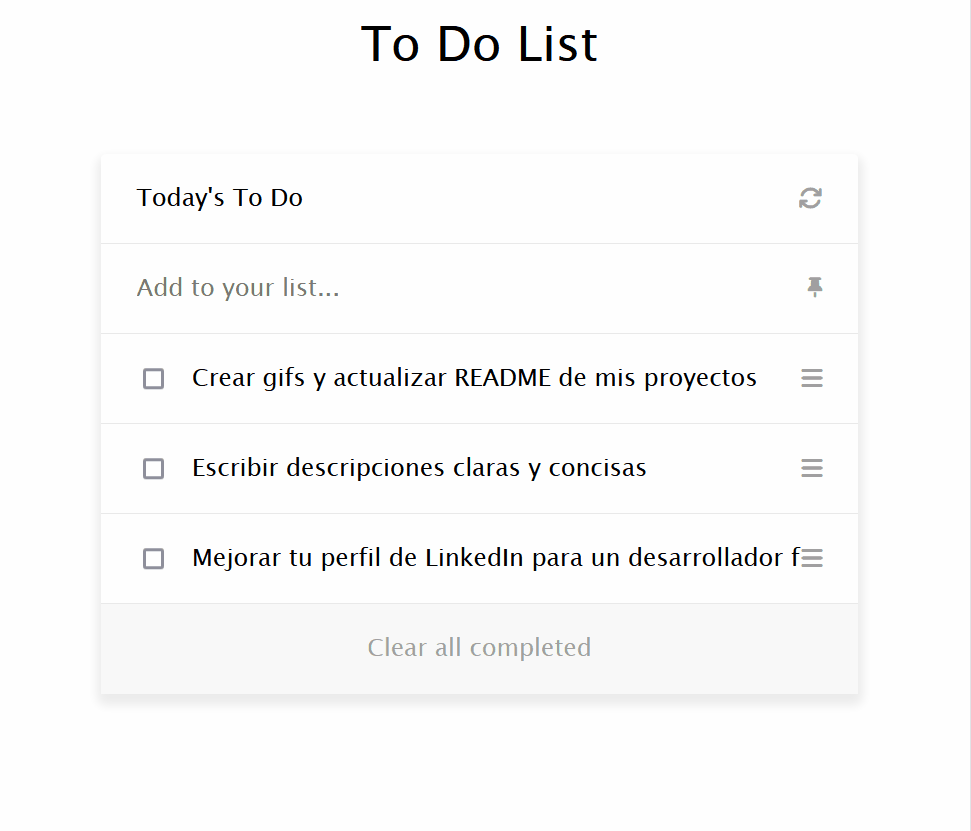

  <h3><b>Welcome To My Project "To Do List"</b></h3>
  
  
Una aplicación To Do List minimalista y versátil construida con JavaScript para organizar tus tareas de forma eficiente.
 

# 📗 Tabla de Contenidos

- [📖 Acerca del Proyecto](#acerca-del-proyecto)
  - [🛠 Construido con](#construido-con)
    - [Tecnologías](#tecnologias)
    - [Características Principales](#caracteristicas-principales)
  - [🚀 Demostración en Vivo](#demostracion-en-vivo)
- [💻 Cómo Empezar](#como-empezar)
  - [Prerrequisitos](#prerrequisitos)
  - [Configuración](#configuracion)
  - [Instalación](#instalacion)
  - [Uso](#uso)
  - [Ejecutar Pruebas](#ejecutar-pruebas)
- [👥 Autores](#autores)
- [🔭 Características Futuras](#caracteristicas-futuras)
- [🤝 Contribuciones](#contribuciones)
- [⭐️ Mostrar tu Apoyo](#mostrar-tu-apoyo)
- [🙏 Agradecimientos](#agradecimientos)
- [📝 Licencia](#licencia)

# 📖 Acerca del Proyecto 

"To Do List" es una aplicación web que te ayuda a organizar tus tareas diarias de manera simple y eficiente. Su interfaz intuitiva te permite agregar, modificar, eliminar y marcar tareas como completadas con facilidad. Desarrollada con JavaScript, esta aplicación ofrece una experiencia de usuario fluida.

**Características Destacadas:**

*   **Gestión de tareas:** Agrega, edita, elimina y marca tareas como completadas.
*   **Interfaz minimalista:** Diseño limpio y fácil de usar.
*   **Almacenamiento local:** Tus tareas se guardan en tu navegador.
*   **Construida con tecnologías web:** HTML, CSS y JavaScript.

## 🛠 Construido con 

### Tecnologías 

-   [HTML](https://www.w3schools.com/html/default.asp)
-   [CSS](https://www.w3schools.com/css/default.asp)
-   [JavaScript](https://www.javascript.com/)
-   [React](https://reactjs.org/)
-   [react-dom](https://reactjs.org/docs/react-dom.html)
-   [webpack](https://webpack.js.org/)
-   [babel](https://babeljs.io/)
-   [eslint](https://eslint.org/)

### Características Principales 

-   **Agregar tarea:** Permite añadir nuevas tareas a la lista.
-   **Modificar tarea:** Edita la descripción de una tarea existente.
-   **Eliminar tarea:** Elimina una tarea de la lista.
-   **Marcar como completada:** Marca una tarea como completada.
-   **Limpiar tareas completadas:** Elimina todas las tareas marcadas como completadas.

(<a href="#readme-top">volver al inicio</a>)

## 🚀 Demostración en Vivo 

- [Ver la demostración en vivo](https://mdg0410.github.io/To-Do-List/)

(<a href="#readme-top">volver al inicio</a>)

## 💻 Cómo Empezar 

### Prerrequisitos

-   Un navegador web moderno (Chrome, Firefox, Edge)
-   Git (opcional, para clonar el repositorio)
-   Node.js y npm (para instalar dependencias)

### Configuración

1.  Clonar el repositorio (opcional): `git clone https://github.com/mdg0410/To-Do-List.git`

### Instalación

1.  Abre una terminal en la carpeta del proyecto.
2.  Instala las dependencias: `npm install`

### Uso

1.  Inicia la aplicación: `npm start`
2.  Abre la aplicación en tu navegador.
3.  Agrega nuevas tareas.
4.  Edita, elimina o marca tareas como completadas.

### Ejecutar Pruebas

Actualmente no hay pruebas automatizadas para este proyecto.

(<a href="#readme-top">volver al inicio</a>)

## 👥 Autores 

-   👤 **mdg0410**

-   GitHub: [@mdg0410](https://github.com/mdg0410/)
-   Twitter: [@StevenLevoyer](https://twitter.com/StevenLevoyer)
-   LinkedIn: [Richard Steven Levoyer Chavez](https://www.linkedin.com/in/richard-steven-levoyer-chavez-9b902525b/)

(<a href="#readme-top">volver al inicio</a>)

## 🔭 Características Futuras 

-   [ ] Agregar animaciones/transiciones.
-   [ ] Permitir a los usuarios crear cuentas para guardar sus tareas en la nube.

(<a href="#readme-top">volver al inicio</a>)

## 🤝 Contribuciones 

Se aceptan contribuciones. Por favor, crea un fork del repositorio y envía un pull request con tus cambios.

(<a href="#readme-top">volver al inicio</a>)

## ⭐️ Mostrar tu Apoyo 

Si te gusta este proyecto, ¡dale una estrella en GitHub!

(<a href="#readme-top">volver al inicio</a>)

## 🙏 Agradecimientos 

- Agradezco a la comunidad de desarrolladores web por su apoyo e inspiración.

(<a href="#readme-top">volver al inicio</a>)

## 📝 Licencia 

-   Este proyecto tiene la licencia [MIT](https://github.com/mdg0410/To-Do-List/blob/main/LICENSE).

(<a href="#readme-top">volver al inicio</a>)

